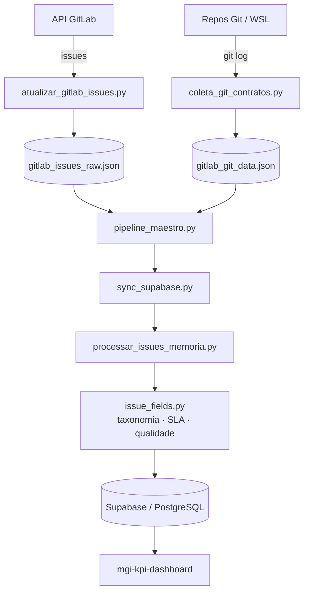

# MGI KPI Pipeline

[](https://github.com/MariaHilmar/mgi-kpi-pipeline/actions/workflows/tests.yml)


[](LICENSE)

Engenharia de dados e automação voltada para **monitoramento de performance de equipes de software**: um pipeline ETL que extrai issues e commits, aplica regras de negócio em memória (taxonomia, SLA, qualidade) e sincroniza com um backend Supabase que alimenta dashboards de BI.

> **Aviso legal:** este é um projeto de **portfólio pessoal** demonstrando habilidades em ETL, orquestração e integração de APIs. **Não é um sistema oficial do MGI** ou de qualquer órgão público. O pipeline nasceu da experiência com dados do ecossistema **MGI** (issues GitLab, commits e KPIs de contratos), mas **não contém dados reais, tokens ou credenciais** — tudo é configurável via `.env`.

---

## Visão geral

Pipeline ETL desenvolvido para **substituir planilhas manuais (Excel)** por uma arquitetura automatizada. O sistema extrai dados de issue trackers e repositórios Git, processa regras de negócio (taxonomia, área funcional, SLA, qualidade) **em memória** e sincroniza com o Supabase (PostgreSQL), servindo como base para o dashboard web [`mgi-kpi-dashboard`](https://github.com/MariaHilmar/mgi-kpi-dashboard). **O Excel não faz mais parte do fluxo.**

---

## Destaques técnicos

- **Lógica pura e testável** — derivação de campos (datas, lead time, idade, SLA, qualidade) sem dependência de Excel/openpyxl
- **Processamento em memória** — issue crua → record Supabase com taxonomia, área funcional, tipo e enriquecimento Dev/Git
- **Extração híbrida** — API GitLab para issues + `git log` (via WSL) para commits, branches e releases
- **Persistência idempotente** — upsert no Supabase evita duplicar issues, releases e participantes
- **Orquestração nativa** — scripts Python integrados ao Windows Task Scheduler (sem servidor dedicado)
- **Configuração via env vars** — nenhum token, caminho ou credencial hardcoded
- **Pytest + Ruff** — testes unitários de lógica pura e lint em cada push/PR
- **GitHub Actions** — CI automatizado (Python 3.11/3.12)

---

## Arquitetura



### Fluxo de dados

1. **Extração** — `atualizar_gitlab_issues.py` coleta issues via API GitLab; `coleta_git_contratos.py` processa `git log` local (via WSL) para commits, branches e releases.
2. **Transformação** — engine em memória (`processar_issues_memoria.py` + `issue_fields.py`) aplica taxonomia e área funcional, calcula SLA, lead time e idade da issue, enriquece dados Dev/Git e valida qualidade.
3. **Carga** — `sync_supabase.py` faz upsert das issues, releases, `sync_runs`, `gitlab_users` e `issue_participants` no Supabase (PostgreSQL).

> **Nota de design — por que processar em memória?**
> As regras de negócio (taxonomia, área funcional, SLA, qualidade) rodam como
> **funções Python puras** (`issue_fields.py`), sem I/O nem estado global. A escolha é
> deliberada e adequada à escala do problema (issues/commits de alguns repositórios):
> - **Testabilidade** — cada regra é testável isoladamente com `pytest`, sem banco nem mocks pesados.
> - **Simplicidade operacional** — não exige servidor de processamento; roda como script + Task Scheduler.
> - **Idempotência** — o resultado é recalculado e persistido via upsert, então reprocessar é seguro.
>
> Para volumes muito maiores (milhões de registros) ou regras que precisassem ser
> reaproveitadas fora do Python, a evolução natural seria processar em lotes/streaming
> ou materializar parte da lógica em **views/funções SQL** no próprio Supabase.

---

## Stack

| Camada | Tecnologia |
|--------|------------|
| Linguagem | Python 3.11+ (CI em 3.12) |
| Persistência | Supabase (PostgreSQL) |
| Extração | API GitLab (`requests`), `git log` via WSL |
| Orquestração | Scripts Python + Windows Task Scheduler |
| Testes | pytest, pytest-cov |
| Qualidade | Ruff (lint) |
| CI/CD | GitHub Actions (lint + test) |

---

## Principais módulos

O projeto usa um layout **flat** (código na raiz), de propósito: os scripts de orquestração e o Task Scheduler do Windows invocam os módulos pelo nome do arquivo (`python pipeline_maestro.py`). A prioridade é operação local e CI simples.

| Módulo | Responsabilidade |
|--------|------------------|
| `pipeline_maestro.py` | Orquestrador central (entry point). |
| `sync_supabase.py` | Camada de persistência: carrega, filtra, processa e faz upsert no Supabase. |
| `processar_issues_memoria.py` | Transforma issues cruas em records do Supabase (em memória). |
| `issue_fields.py` | Core de regras de negócio: datas, lead time, idade, SLA, qualidade. |
| `taxonomy.py` / `detectar_area_funcional.py` / `inferir_tipo_issue.py` | Motores de inferência e classificação. |
| `enriquecer_dev_git.py` | Enriquecimento Dev/Git (branch, commits, MRs). |
| `coleta_git_contratos.py` | Coleta commits/branches/releases dos repositórios Git. |
| `atualizar_gitlab_issues.py` | Baixa issues via API GitLab. |
| `config.py` | Configuração centralizada (paths, flags, tokens) via env vars. |
| `issue_filters.py` / `issue_keys.py` | Filtros (data de corte, fechadas antigas) e chaves compostas. |
| `gitlab_identities.py` | Agrega usuários GitLab e participantes por issue. |
| `backfill_profile_gitlab_ids.py` / `provision_gitlab_users.py` | Vinculação e provisionamento de identidades GitLab ↔ Supabase. |

Testes em `tests/` (`pytest`).

---

## Pré-requisitos

- Python **3.11+**
- Git (para clones locais / `git log`)
- (Opcional) Conta Supabase e token GitLab próprios para rodar o sync completo

---

## Instalação e execução

```powershell
git clone https://github.com/MariaHilmar/mgi-kpi-pipeline.git
cd mgi-kpi-pipeline

python -m venv .venv
.venv\Scripts\Activate.ps1        # Windows
# source .venv/bin/activate       # Linux/macOS

pip install -r requirements-dev.txt
copy .env.example .env             # ou: cp .env.example .env
```

Dependências de runtime ficam em `requirements.txt` (apenas `requests`); as de desenvolvimento/teste em `requirements-dev.txt`.

### Comandos principais

```bash
# Coleta de issues (incremental / carga completa)
python atualizar_gitlab_issues.py
python atualizar_gitlab_issues.py --full

# Pipeline completo (incremental)
python pipeline_maestro.py
python pipeline_maestro.py --full           # reprocessa metadados
python pipeline_maestro.py --all-modules    # inclui todos os módulos
python pipeline_maestro.py --initial-load   # carga inicial (histórico)

# Sincronização direta para o Supabase
python sync_supabase.py
python sync_supabase.py --json "D:\caminho\gitlab_issues_raw.json"
python sync_supabase.py --sem-git --sem-releases

# Vincular perfis do dashboard ao GitLab (após migration 012)
python backfill_profile_gitlab_ids.py --dry-run
python backfill_profile_gitlab_ids.py
```

### Variáveis de ambiente

Todas opcionais (têm default em `config.py`). Para o sync, use um `.env` na raiz do workspace. Veja `.env.example`.

| Variável | Default | Descrição |
|----------|---------|-----------|
| `MGI_BASE_DIR` | pasta do workspace | Base para logs/JSON. |
| `MGI_REPOS` | *(vazio)* | Clones Git locais: `path=repo_slug;path2=slug2`. |
| `MGI_WSL_REPO_PATHS` | slugs padrão | Caminhos WSL para `git log`: `slug=/wsl/path`. |
| `MGI_ISSUES_JSON` | `gitlab_issues_raw.json` | Fonte das issues processadas. |
| `MGI_ALL_MODULES` | `1` | `1` = todos os módulos; `0` = subconjunto. |
| `MGI_CLOSED_EXCLUDE_DAYS` | `60` | Exclui issues fechadas há mais de N dias. |
| `MGI_INITIAL_LOAD` | `0` | Carga inicial (inclui histórico). |
| `MGI_FAST_REPO_SYNC` | `0` | `1` desliga detectores Git (usa só título/labels). |
| `MGI_SINCE_DAYS` | `30` | Janela de coleta Git. |
| `GITLAB_URL` / `GITLAB_TOKEN` | `https://gitlab.com` / vazio | Integração GitLab (token nunca no código). |
| `SUPABASE_URL` / `SUPABASE_SERVICE_ROLE_KEY` | — | Necessárias para o sync com o Supabase. |

---

## Agendamento (opcional — Windows)

Para execução diária automática no **Windows Task Scheduler**, use `agendar_task_scheduler.ps1` / `desagendar_task_scheduler.ps1`. Não é necessário para desenvolvimento nem para o repositório público. Detalhes em [docs/05-agendamento.md](docs/05-agendamento.md).

---

## Testes e qualidade

```bash
pytest          # testes + cobertura mínima (38%)
ruff check .    # lint
```

A suíte cobre a derivação de campos (`issue_fields`), a construção de records (`processar_issues_memoria`), os filtros e o cliente de sync (`sync_supabase`, com `requests` mockado), além das funções puras de taxonomia, datas e chaves. Toda alteração é validada pelo **GitHub Actions** (`ruff check` + `pytest` em Python 3.11/3.12). Referência de CI GitLab legado: [docs/legacy-gitlab-ci.yml](docs/legacy-gitlab-ci.yml).

---

## Banco de dados (Supabase)

O schema versionado fica em `../supabase/migrations` (até **012** — identidades GitLab). Aplicar via SQL Editor do Supabase ou `supabase db push`. Contrato completo: [docs/03-integracao-dashboard.md](docs/03-integracao-dashboard.md) e `mgi-kpi-dashboard/docs/10-identidades-gitlab.md`.

---

## Documentação

| Documento | Conteúdo |
|-----------|----------|
| [docs/01-arquitetura.md](docs/01-arquitetura.md) | Arquitetura detalhada. |
| [docs/02-modulos.md](docs/02-modulos.md) | Descrição dos módulos. |
| [docs/03-integracao-dashboard.md](docs/03-integracao-dashboard.md) | Contrato de dados com o dashboard. |
| [docs/04-configuracao-execucao.md](docs/04-configuracao-execucao.md) | Configuração e execução. |
| [docs/05-agendamento.md](docs/05-agendamento.md) | Agendamento no Windows. |
| [docs/08-repositorio-github.md](docs/08-repositorio-github.md) | Fluxo do repositório e CI. |

---

## Licença

Este projeto está licenciado sob a Licença MIT — veja o arquivo [LICENSE](LICENSE) para detalhes.
